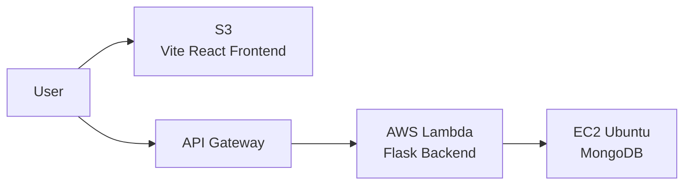

---
{: .no_toc }

<details open markdown="block">
  <summary>
    Table of contents
  </summary>
  {: .text-delta }
1. TOC
{:toc}
</details>

---

# TODO List app
This small app we are going to use the following structure
- the frontend will use React and deployed in S3
- The backend will use Flask and deployed in Lambda
- The Database will deployed in Ubuntu EC2

Based on your requirements, here is a complete, hands-on example of deploying a three-tier application with **Vite React** on S3, **Flask** on AWS Lambda, and **MongoDB** on an Ubuntu EC2 instance.

This guide includes all the essential code and configuration steps to get your application up and running.

---

## 🏗️ Architecture Overview



- **Frontend**: Vite React static files hosted on S3.
- **Backend**: Flask application running on AWS Lambda, exposed via Amazon API Gateway.
- **Database**: MongoDB installed on an Ubuntu EC2 instance.

---

## 📁 Step 1: Vite React Frontend (Deployed to S3)

### 1.1 Create the React App with Vite

```bash
# Create a new Vite React project
npm create vite@latest my-frontend -- --template react
cd my-frontend
npm install
```

### 1.2 Create the Frontend Code

Replace `src/App.jsx` with:

```jsx
import React, { useState, useEffect } from 'react';
import axios from 'axios';

// Use environment variable for API URL
const API_URL = import.meta.env.VITE_API_URL || 'https://your-api-id.execute-api.region.amazonaws.com/prod/api';

function App() {
  const [todos, setTodos] = useState([]);
  const [newTodo, setNewTodo] = useState('');

  useEffect(() => {
    fetchTodos();
  }, []);

  const fetchTodos = async () => {
  try {
    const response = await axios.get(`${API_URL}/todos`);
    
    // Ensure response.data is an array, even if the API returns something else
    if (Array.isArray(response.data)) {
      setTodos(response.data);
    } else {
      console.warn('API returned non-array data:', response.data);
      setTodos([]); // Reset to empty array to prevent crashes
    }
  } catch (error) {
    console.error('Error fetching todos:', error);
    setTodos([]); // Reset to empty array on error
  }
};

  const addTodo = async () => {
    if (!newTodo.trim()) return;
    try {
      const response = await axios.post(`${API_URL}/todos`, { text: newTodo });
      setTodos([...todos, response.data]);
      setNewTodo('');
    } catch (error) {
      console.error('Error adding todo:', error);
    }
  };

  const deleteTodo = async (id) => {
    console.log('id is :',id)
    try {
      await axios.delete(`${API_URL}/todos/${id}`);
      setTodos(todos.filter(todo => todo._id !== id));
    } catch (error) {
      console.error('Error deleting todo:', error);
    }
  };

  return (
    <div style={{ maxWidth: '500px', margin: '50px auto', fontFamily: 'Arial' }}>
      <h1>Todo List</h1>
      <div>
        <input
          type="text"
          value={newTodo}
          onChange={(e) => setNewTodo(e.target.value)}
          placeholder="Add a new todo"
          style={{ padding: '8px', width: '60%' }}
        />
        <button onClick={addTodo} style={{ padding: '8px 16px', marginLeft: '10px' }}>
          Add
        </button>
      </div>
      <ul style={{ listStyle: 'none', padding: 0, marginTop: '20px' }}>
        {todos.map(todo => (
          <li key={todo._id} style={{ padding: '8px 0', borderBottom: '1px solid #ccc' }}>
            <span>{todo.text}</span>
            <button
              onClick={() => deleteTodo(todo._id)}
              style={{ float: 'right', color: 'red', background: 'none', border: 'none', cursor: 'pointer' }}
            >
              ✖
            </button>
          </li>
        ))}
      </ul>
    </div>
  );
}

export default App;
```

### 1.3 Create Environment Variable File

Create `.env.production`:

```env
VITE_API_URL=https://your-api-id.execute-api.region.amazonaws.com/prod/api
```

> **Note**: You'll update this URL after deploying your Lambda/API Gateway.

### 1.4 Build and Deploy to S3

```bash
# Build the React app
npm run build

# Create S3 bucket
BUCKET_NAME="vite-react-frontend-$(date +%s)"
aws s3 mb s3://$BUCKET_NAME --region us-east-1

# Upload the build folder to S3
aws s3 sync dist/ s3://$BUCKET_NAME

# Enable static website hosting
aws s3api put-bucket-website --bucket $BUCKET_NAME \
  --website-configuration '{"IndexDocument": {"Suffix": "index.html"}, "ErrorDocument": {"Key": "index.html"}}'

# Make bucket public (for simple demo; use OAI in production)
aws s3api put-public-access-block --bucket $BUCKET_NAME \
  --public-access-block-configuration BlockPublicAcls=false,IgnorePublicAcls=false,BlockPublicPolicy=false,RestrictPublicBuckets=false

aws s3api put-bucket-policy --bucket $BUCKET_NAME --policy '{
  "Version": "2012-10-17",
  "Statement": [{
    "Effect": "Allow",
    "Principal": "*",
    "Action": "s3:GetObject",
    "Resource": "arn:aws:s3:::'$BUCKET_NAME'/*"
  }]
}'

echo "Frontend URL: http://$BUCKET_NAME.s3-website-us-east-1.amazonaws.com"
```

You need to deselect the enable of block public access in the S3 bucket

---

## 🐍 Step 2: Flask Backend (Deployed to AWS Lambda)

### 2.1 Create the Flask Application

Create a new directory for the backend:

```bash
mkdir my-backend
cd my-backend
```

Create `app.py`:

```python
import json
import pymongo
import os
from bson import ObjectId
from flask import Flask, request, jsonify
from flask_cors import CORS
import logging
import sys
from datetime import datetime
import traceback

# Configure logging
logger = logging.getLogger()
logger.setLevel(logging.INFO)
console_handler = logging.StreamHandler(sys.stdout)
console_handler.setLevel(logging.INFO)
formatter = logging.Formatter('%(asctime)s - %(name)s - %(levelname)s - %(message)s')
console_handler.setFormatter(formatter)
logger.addHandler(console_handler)
app = Flask(__name__)
CORS(app)

# MongoDB connection from environment variable
MONGO_URI = os.environ.get('MONGO_URI', 'mongodb://localhost:27017/todo')
client = pymongo.MongoClient(MONGO_URI)
db = client.get_database()
todos_collection = db.todos

@app.after_request
def after_request(response):
    response.headers.add('Access-Control-Allow-Origin', '*')
    response.headers.add('Access-Control-Allow-Headers', 'Content-Type,Authorization,X-Requested-With')
    response.headers.add('Access-Control-Allow-Methods', 'GET,PUT,POST,DELETE,OPTIONS')
    response.headers.add('Access-Control-Allow-Credentials', 'true')
    return response

# ============== Routes ==============

@app.route('/api/test', methods=['GET'])
def test():
    logger.info("Test endpoint called")
    print(f'I am in the test point')
    return jsonify({
        'status': 'success',
        'message': 'Lambda is working!',
        'timestamp': datetime.utcnow().isoformat()
    })

@app.route('/api/todos', methods=['GET'])
def get_todos():
    print(f'I am in the get todos point')
    logger.info("GET /api/todos called")
    todos = list(todos_collection.find())
    print(f'after Found  todos')
    for todo in todos:
        todo['_id'] = str(todo['_id'])
    return jsonify(todos)

@app.route('/api/todos', methods=['POST'])
def add_todo():
    print(f'I am in the add todo point')
    logger.info("POST /api/todos called")
    data = request.json
    print(f'request.json is {data}')
    if not data or 'text' not in data:
        return jsonify({'error': 'Missing text field'}), 400
    todo = {'text': data['text'], 'completed': False}
    result = todos_collection.insert_one(todo)
    todo['_id'] = str(result.inserted_id)
    return jsonify(todo), 201

@app.route('/api/todos/<todo_id>', methods=['DELETE'])
def delete_todo(todo_id):
    print(f'I am in the delete todo point. todo_id is: {todo_id}')
    try:
        obj_id = ObjectId(todo_id)
    except:
        return jsonify({'error': 'Invalid todo ID'}), 400
    result = todos_collection.delete_one({'_id': obj_id})
    if result.deleted_count == 0:
        return jsonify({'error': 'Todo not found'}), 404
    return jsonify({'message': 'Todo deleted'}), 200

# Lambda handler
def handler(event, context):
    # # Convert API Gateway event to Flask request
    # from mangum import Mangum
    # handler_func = Mangum(app)
    # return handler_func(event, context)

    """Main Lambda handler"""
    logger.info(f"Event: {json.dumps(event)}")
    
    try:
        from werkzeug.test import EnvironBuilder
        from werkzeug.wrappers import Response
        
        # Extract request details
        method = event.get('httpMethod', 'GET')
        path = event.get('path', '/')
        headers = event.get('headers', {})
        body = event.get('body', '')
        query_string = event.get('queryStringParameters', {})
        
        # Build environment
        builder = EnvironBuilder(
            method=method,
            path=path,
            headers=headers,
            data=body,
            query_string=query_string
        )
        environ = builder.get_environ()
        
        # ============== FIX: Properly handle Flask call ==============
        # Flask expects (environ, start_response) where start_response is a function
        # that takes (status, headers) as arguments
        
        response_data = []
        response_status = None
        response_headers = None
        
        def start_response(status, headers, exc_info=None):
            nonlocal response_status, response_headers
            response_status = status
            response_headers = headers
            return response_data.append
        
        # Call Flask with proper arguments
        result = app(environ, start_response)
        
        # Get the response body
        if hasattr(result, '__iter__'):
            # It's an iterable
            body_bytes = b''.join(result)
        else:
            body_bytes = result if isinstance(result, bytes) else b''
        
        # If the response data was captured via start_response
        if response_data:
            body_bytes = b''.join(response_data)
        
        # Parse status code from status string (e.g., "200 OK" -> 200)
        status_code = int(response_status.split(' ')[0]) if response_status else 200
        
        # Build headers dict
        headers_dict = {}
        if response_headers:
            for key, value in response_headers:
                headers_dict[key] = value
        
        # Add CORS headers
        headers_dict['Access-Control-Allow-Origin'] = '*'
        headers_dict['Access-Control-Allow-Headers'] = 'Content-Type,Authorization,X-Requested-With'
        headers_dict['Access-Control-Allow-Methods'] = 'GET,PUT,POST,DELETE,OPTIONS'
        
        # Convert body to string
        body_str = body_bytes.decode('utf-8') if isinstance(body_bytes, bytes) else str(body_bytes)
        
        return {
            'statusCode': status_code,
            'headers': headers_dict,
            'body': body_str,
            'isBase64Encoded': False
        }
        
    except Exception as e:
        logger.error(f"Error: {str(e)}")
        logger.error(traceback.format_exc())
        return {
            'statusCode': 500,
            'headers': {
                'Content-Type': 'application/json',
                'Access-Control-Allow-Origin': '*'
            },
            'body': json.dumps({
                'status': 'error',
                'message': str(e),
                'type': type(e).__name__
            })
        }

if __name__ == '__main__':
    app.run(host='0.0.0.0', port=5000, debug=True)
```

### 2.2 Create `requirements.txt`

```
flask==2.3.2
flask-cors==4.0.0
pymongo==4.5.0
mangum==0.17.0
```

### 2.3 Package the Lambda Function

```bash
# Create a deployment package
pip install -r requirements.txt -t ./package
cp app.py ./package/
cd package
zip -r ../lambda-function.zip .
cd ..

# Upload the zip to S3 (or directly to Lambda)
aws s3 cp lambda-function.zip s3://your-bucket-for-lambda/
```

### 2.4 Create Lambda Function in AWS

```bash
# Create the Lambda function (using Python 3.11)
aws lambda create-function \
  --function-name flask-todo-api \
  --runtime python3.11 \
  --role arn:aws:iam::<YOUR_ACCOUNT_ID>:role/lambda-execution-role \
  --handler app.handler \
  --timeout 30 \
  --memory-size 128 \
  --environment Variables={MONGO_URI=mongodb://<EC2_PRIVATE_IP>:27017/todo} \
  --code S3Bucket=your-bucket-for-lambda,S3Key=lambda-function.zip
```

You need to configure the VPC of lambda, 
1. Configuration
2. Select `VPC` on the left side bar
3. Select the VPC that the EC2 database located in
4. Select the security group, if test, then just place in the public subnets

### 2.5 Create API Gateway

```bash
# Create a REST API
aws apigateway create-rest-api --name flask-todo-api --region us-east-1

# Create a resource and methods (use AWS Console or CLI)
# For simplicity, create a proxy resource to forward all requests to Lambda
```

**Or use the AWS Console:**
1. Go to API Gateway → Create API → REST API
2. Choose "Build" for REST API
3. Hit the button "Create resource" to add `api`
4. Under the `api`, hit the button "Create resource" to add `todos`
5. Select `todos`, click the button "Enable CORS" to let the frontent connect to the API Gateway
6. Add "Create method"  to add methods, you can choose 'ANY', and Select the `Lambda proxy integration`.
7. About the delete todo, under the `todos`, create resource `{id}`, enable 'Enable CORS', and add method `DELETE`.
8. Select the `DELETE` method, and confirm the Response headers has the same categories as the Header mappings in Integration response of `OPTIONS` 

After deployment, note the **API Gateway endpoint URL** (e.g., `https://api-id.execute-api.region.amazonaws.com/prod`).

---

## 🗄️ Step 3: MongoDB on Ubuntu EC2

### 3.1 Launch Ubuntu EC2 Instance

1. Go to EC2 Console → Launch Instance
2. AMI: **Ubuntu 22.04 LTS** (or 20.04)
3. Instance type: `t2.micro` (free tier) or `t3.medium`
4. Security group: Open port **22** (SSH) and **27017** (MongoDB) → source: **your VPC CIDR** or **specific IP**
5. Storage: at least **20 GiB**
6. Launch

### 3.2 Connect and Install MongoDB

```bash
# SSH into the EC2 instance
ssh -i your-key.pem ubuntu@<EC2_PUBLIC_IP>

# Update package list
sudo apt update

# Install MongoDB
sudo apt install -y mongodb

# Start MongoDB
sudo systemctl start mongod
sudo systemctl enable mongod

# Check status
sudo systemctl status mongod

# Configure MongoDB to accept external connections
sudo nano /etc/mongod.conf
```

Change the `bindIp` line to `0.0.0.0` (or your VPC CIDR):

```yaml
net:
  port: 27017
  bindIp: 0.0.0.0
```

```bash
# Restart MongoDB
sudo systemctl restart mongod

# Create a database user (optional but recommended)
mongosh
use todo
db.createUser({
  user: "admin",
  pwd: "your-password",
  roles: [{ role: "readWrite", db: "todo" }]
})
```

You can follow the MongoDB [official documents to install the mongod in the EC2 ubuntu server](https://www.mongodb.com/docs/v8.0/tutorial/install-mongodb-on-ubuntu/)

### 3.3 Get the Private IP Address

```bash
# Get the private IP of the EC2 instance
curl http://169.254.169.254/latest/meta-data/local-ipv4
```

Copy this IP address (e.g., `10.0.1.100`). You'll use it for the Lambda environment variable.

---

## 🔗 Step 4: Connect All Tiers

1. **Update the Lambda environment variable** with the MongoDB private IP:
   ```bash
   aws lambda update-function-configuration \
     --function-name flask-todo-api \
     --environment Variables={MONGO_URI=mongodb://10.0.1.100:27017/todo}
   ```

2. **Update the React frontend** API URL:
   - Update `.env.production` with the API Gateway URL
   - Rebuild and redeploy to S3:
   ```bash
   npm run build
   aws s3 sync dist/ s3://vite-react-frontend-xxx
   ```

---

## 🧪 Step 5: Test the Full Application

1. **Open the S3 website URL** in your browser
2. **Add a todo** → Should be saved in MongoDB via Lambda
3. **Delete a todo** → Should be removed
4. **Refresh the page** → Todos should reappear

---

## 📊 Summary

| Tier | Technology | Deployment Location |
| :--- | :--- | :--- |
| **Frontend** | Vite React | S3 (static website) |
| **Backend** | Flask | AWS Lambda (via API Gateway) |
| **Database** | MongoDB | EC2 Ubuntu (self-hosted) |

---

## 🧹 Clean Up

```bash
# Delete S3 bucket
aws s3 rm s3://vite-react-frontend-xxx --recursive
aws s3 rb s3://vite-react-frontend-xxx

# Delete Lambda function
aws lambda delete-function --function-name flask-todo-api

# Delete API Gateway
# (via AWS Console)

# Terminate EC2 instance
aws ec2 terminate-instances --instance-ids <INSTANCE_ID>
```

---

This example provides a complete, serverless architecture for your three-tier application, with the backend running on Lambda for scalability and the database on a self-managed EC2 instance. You can now adapt this pattern to your own Flask application and React frontend.
